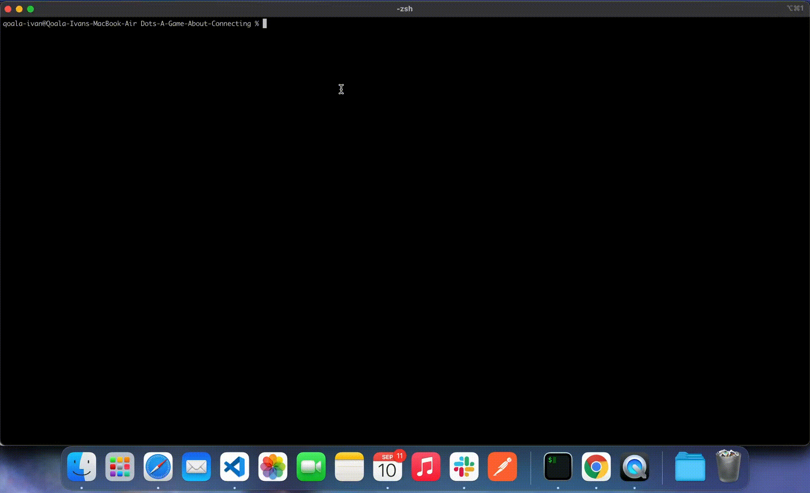

# Dots-A-Game-About-Connecting
Find a circular cycle with same color in `Dots: A Game About Connecting` using DFS Algorithm.

# Requirements
- Java

# How to use?

1. Clone the repository.
2. Construct the matrix and its color as you wish.
3. Compile main file with the following command.

    ```shell
    javac Main.java
    ```

4. Run the program.

    ```shell
    java Main
    ```

# Screenshots


**Figure 1** - App preview


**Figure 2** - Define the matrix colors
